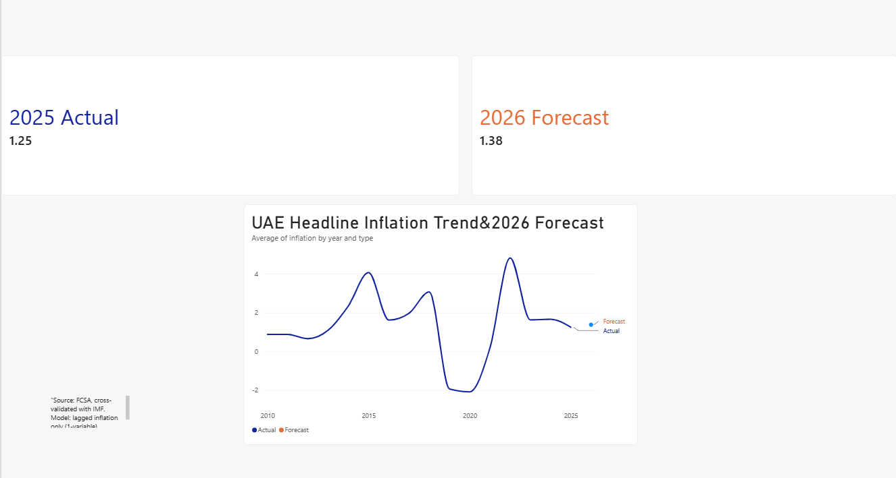
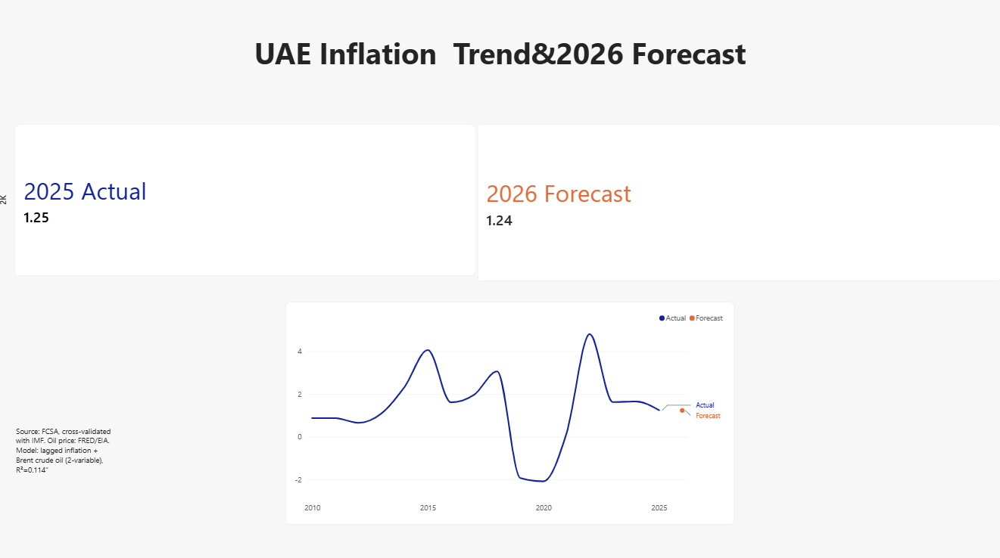

# UAE Inflation Trend & Forecasting Analysis

## Overview
Analysis of UAE headline inflation (2010-2025) using official government data, 
with two forecasting models built to project 2026 inflation. Built to demonstrate 
economic modeling, forecasting, and data visualization skills.

## Data Sources
- **FCSA** (UAE Federal Competitiveness and Statistics Centre) - official annual CPI, 2010-2025
- **IMF/World Bank Global Inflation Database** - used for cross-validation
- **FRED/EIA** - Brent crude oil annual average prices

## Methodology
Two regression models were tested:
| Model | Predictors | R² | 2026 Forecast |
|---|---|---|---|
| Model 1 | Lagged inflation only | 0.058 | 1.38% |
| Model 2 | Lagged inflation + Brent oil price | 0.114 | 1.24% |

Tools: Python (pandas, scikit-learn, matplotlib), Power BI

## Key Findings
- UAE inflation has moderated significantly since the 2022 peak (4.82%)
- 2026 forecast (1.24-1.38%) is notably below official Central Bank of UAE (2.3%) 
  and World Bank (2.0-2.5%) projections
- This gap suggests structural factors (subsidies, currency-peg monetary policy, 
  housing costs) drive UAE inflation more than historical momentum or oil price alone

## Files
- `inflation_analysis.py` - Python analysis and forecasting code
- `uae_inflation_data.csv` - Cleaned FCSA inflation data
- `uae_inflation_with_forecast_v2.csv` - Data with 2-variable model forecast
- `UAE_Inflation_Dashboard.pbix` - Power BI dashboard (2 pages)
- `policy_brief.pdf` - Written policy brief (Pyramid Principles structure)
- `dashboard_screenshots/` - Preview images of both dashboard pages

## Dashboard Preview

